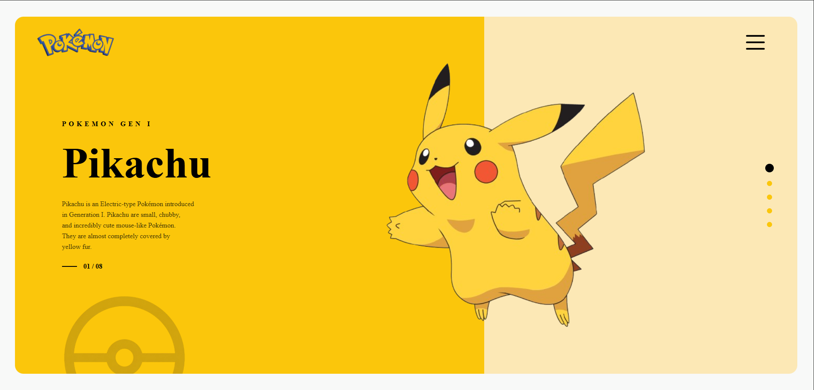

# Pikachu Gen I | Sheryians Cohort 3.0

"**Pika pika! | Pikachu** are small, chubby, and incredibly cute... but they pack a powerful spark!"

Welcome to my first major design assignment for the  **Sheryians Coding School Cohort 3.0** .

# 📸 Sneak Peek

[Live link | Pika pika!](https://yashrajsinghmeel.github.io/Cohort3-A1/)

# 🌻 A Note for the Reviewer

This project was built to master the fundamentals of  **modern CSS layout and UI/UX design** . Just like a Pikachu evolves with training, I’ve poured hours into ensuring the responsiveness (almost responsive on landscape screen sizes) and "vibe" of this page match the playful yet bold aesthetic of the Pokémon world. I hope you enjoy the "spark" I've added to this assignment!

# 🛠️ Evolution of the Build (Tech Stack)

To bring this project to life, I used:

* **HTML5:** The skeletal structure of our Poké-world.
* **CSS3:** The yellow fur and rosy cheeks (styling, flexbox, and grid).
* **GitHub Pages:** To make the project live for you all  to see.

# 🎓 Assignment Context

* **School:** Sheryians Coding School
* **Program:** Cohort 3.0 ( Assignment-1 )
* **Objective:** UI/UX Recreation & CSS Mastery

# Made with ⚡ and 💛 by [ Yashraj Singh Meel ]

---
